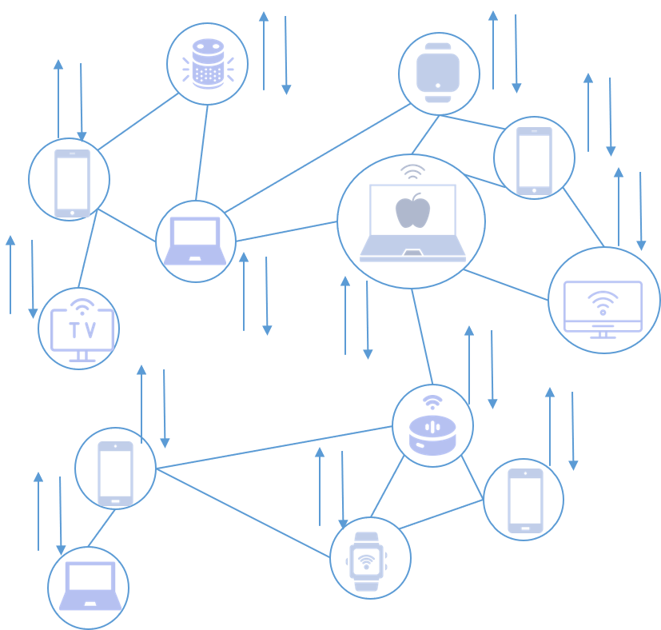
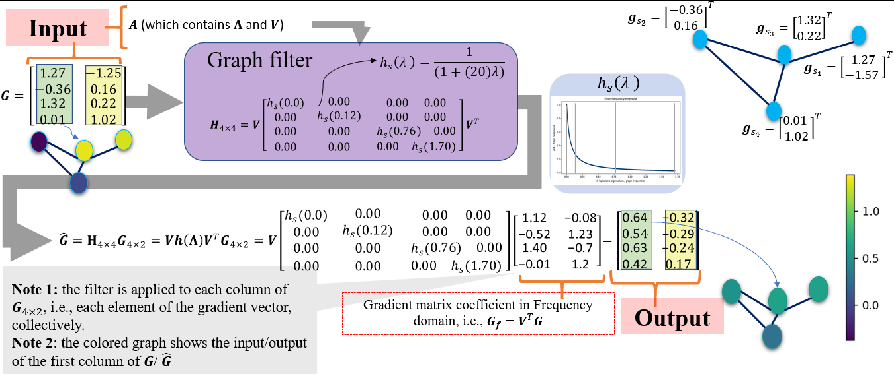

# Graph-Federated-Learning-for-CIoT-Devices

  

   

  

# Citation

@article{rasti2022graph,
  title={Graph Federated Learning for CIoT Devices in Smart Home Applications},
  author={Rasti-Meymandi, Arash and Sheikholeslami, Seyed Mohammad and Abouei, Jamshid and Plataniotis, Konstantinos N},
  journal={IEEE Internet of Things Journal},
  year={2022},
  publisher={IEEE}
}
